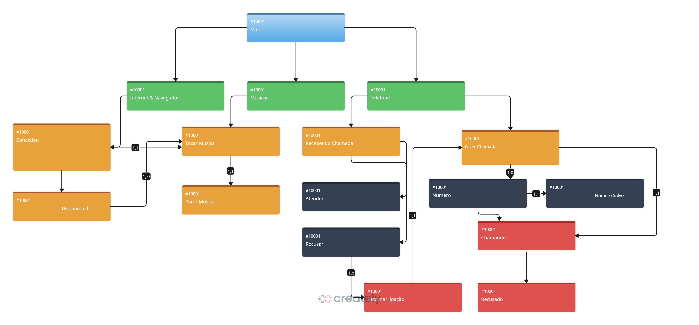

# Projeto iPhone DIO - BRADESCO

## Visão Geral
Este projeto implementa uma simulação simplificada da interface de um iPhone usando Java. Ele demonstra conceitos de Programação Orientada a Objetos como interfaces e polimorfismo, modelando funções essenciais do iPhone, incluindo chamadas telefônicas, reprodução de música e navegação na internet.

## Estrutura do Projeto
O projeto é estruturado com múltiplas interfaces representando diferentes funcionalidades:

- **Ligacao.java** - Define a funcionalidade relacionada a chamadas
- **MusicPlayer.java** - Define a funcionalidade de reprodução de música
- **Navegador.java** - Define a funcionalidade de navegação na internet
- **Telefone.java** - Implementa todas as interfaces, representando o dispositivo iPhone
- **Main.java** - Contém o ponto de entrada do programa e a lógica da interface do usuário

## Diagrama de Classes
O diagrama incluído ilustra as relações entre os componentes do projeto. Ele mostra:

1. A classe principal que inicializa o fluxo da aplicação
2. Três grupos de funcionalidades primárias (Internet & Navegador, Músicas e Telefone)
3. Ações específicas para cada funcionalidade:
    - Conexão e desconexão com a internet
    - Controles de reprodução de música
    - Gerenciamento de chamadas telefônicas (fazer chamadas, receber chamadas, etc.)

O diagrama representa claramente como as funções do iPhone são organizadas e como interagem entre si. É possível ver o fluxo desde o programa principal até os vários serviços e as ações disponíveis dentro de cada serviço.

## Funcionalidades
A aplicação simula:

1. **Conectividade com a Internet**
    - Conectar à internet
    - Desconectar da internet

2. **Reprodutor de Música**
    - Reproduzir músicas a partir de uma seleção
    - Parar a reprodução de música

3. **Funcionalidade de Telefone**
    - Fazer chamadas para contatos
    - Receber chamadas
    - Atender ou recusar chamadas

## Como Usar
1. Execute a classe Main
2. Escolha se deseja se conectar à internet
3. Dependendo da escolha, você poderá:
    - Se conectado: escolher entre navegador, música ou telefone
    - Se desconectado: apenas usar o telefone
4. O programa simulará também chamadas recebidas após um intervalo de tempo

## Implementação de Interfaces
O projeto usa interfaces Java para definir comportamentos específicos que o telefone deve implementar. A classe Telefone implementa todas as interfaces, demonstrando como um único objeto pode ter múltiplos comportamentos.